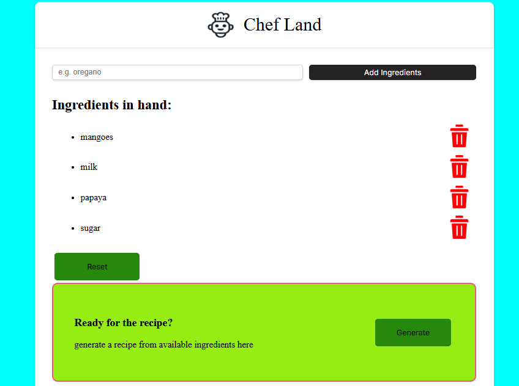
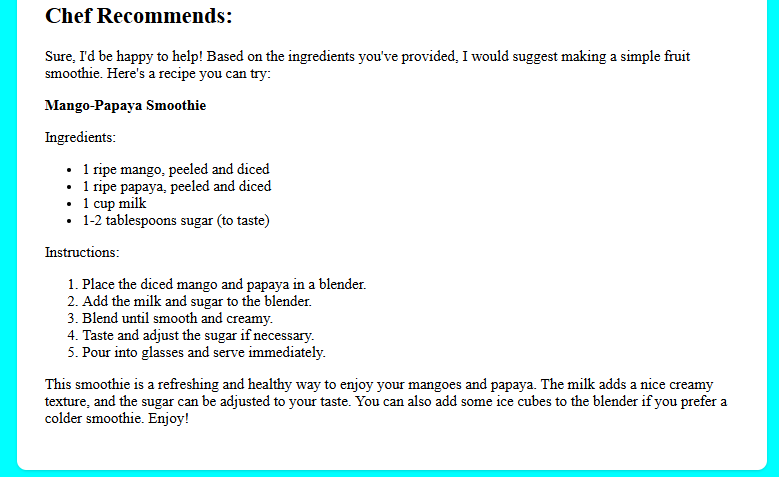

# 👨‍🍳 Chef Land

**Chef Land** is a beginner-friendly React app that allows users to enter a list of ingredients and receive a recipe suggestion generated by an AI language model using the Hugging Face Inference API.

This project was built while learning React for the first time by following [Bob Ziroll's React tutorial on freeCodeCamp.org](https://www.youtube.com/watch?v=x4rFhThSX04&t=35495s&ab_channel=freeCodeCamp.org).

---

## 🚀 Features

- ✅ Add and remove ingredients
- 🤖 Generate recipes using Hugging Face's `chatCompletion` API
- 📝 Recipe output rendered in markdown using `react-markdown`
- 💡 Simple, clean UI with CSS styling

---

## 🧰 Tech Stack

- ⚛️ React (with hooks and functional components)
- 🧠 Hugging Face Inference API (`@huggingface/inference`)
- 📄 React Markdown (`react-markdown`)
- 🎨 Custom CSS for styling

---

## 🛠️ Installation & Setup

1. **Clone the repository**
   ```bash
   git clone https://github.com/your-username/chef-land.git
   cd chef-land
   ```

2. **Install dependencies**
   ```bash
   npm install
   ```

3. **Set up environment variables**

   Create a `.env` file in the root directory and add your Hugging Face API token:

   ```
   REACT_APP_ACCESS_TOKEN=your_huggingface_access_token
   ```

4. **Start the development server**
   ```bash
   npm start
   ```


---

## 📸 Screenshots (Optional)


- 
  
- 


---

## 🙏 Acknowledgements

- 👨‍🏫 [Bob Ziroll’s React Course on freeCodeCamp](https://www.youtube.com/watch?v=x4rFhThSX04&t=35495s&ab_channel=freeCodeCamp.org)
- 🤗 [Hugging Face Inference API](https://huggingface.co/inference-api)


---

## 🔮 Future Enhancements

- 🍽️ Save favorite recipes
- 🗣️ Add voice input using the Web Speech API
- 📸 Ingredient detection using image input
- 📊 Nutrition facts using food APIs (like Spoonacular or Edamam)

